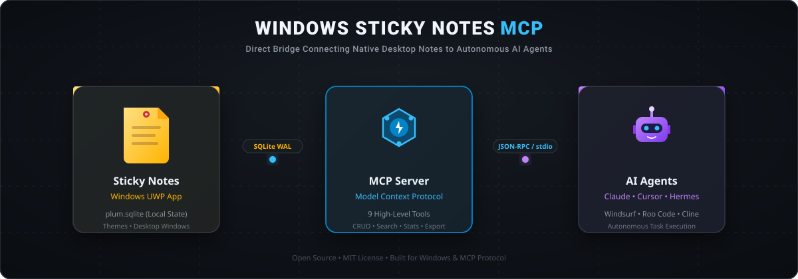

<p align="center">
  
</p>

<h1 align="center">Windows Microsoft Sticky Notes MCP Server 📝</h1>

<p align="center">
  A Model Context Protocol (MCP) server that empowers AI agents (Claude, Cursor, Hermes, Windsurf, Roo Code) with full read, write, search, and management access to <b>Windows Microsoft Sticky Notes</b>.
</p>

<p align="center">
  <a href="https://github.com/widisaadi/stickynotes-mcp/blob/main/LICENSE"></a>
  <a href="https://www.python.org/"></a>
  <a href="https://modelcontextprotocol.io/"></a>
  <a href="https://github.com/widisaadi/stickynotes-mcp/stargazers"></a>
</p>

---

## 💡 Why This Exists

Microsoft Sticky Notes is one of the most accessible daily scrapbooks on Windows, but it has no official public REST API. This MCP server interfaces directly with the native UWP SQLite database (`plum.sqlite`), enabling autonomous AI agents to:

- 📋 Read today's scratchpad, to-do lists, and brainstorm notes.
- 📌 Post daily agendas, schedules, or coding tasks straight to the user's desktop.
- 🔍 Search across historical sticky notes instantly.
- 🎨 Color-code tasks by urgency using native Sticky Note themes.

---

## ✨ Features

- **Full CRUD Support**: Create, read, update (overwrite or append), and delete sticky notes.
- **Desktop Window Control**: Open, close, minimize, or pin notes always-on-top.
- **Theme Color Management**: Support for all native Sticky Notes colors (`Yellow`, `Green`, `Pink`, `Purple`, `Blue`, `Grey`, `Charcoal`).
- **Markdown & Rich-Text Cleaner**: Parses internal Sticky Notes block formatting (`\id=...`, `\b`, `\strike`, `\l`) into clean Markdown.
- **Safe & Non-blocking**: Uses SQLite read-only mode (`mode=ro`) to prevent database locks while the Sticky Notes desktop app is actively running.
- **Safety First**: Automatically creates a backup (`plum.sqlite.mcp.bak`) before any mutation.
- **Soft Delete & Trash Recovery**: Default soft delete (`DeletedAt` timestamp) allows restoring accidentally deleted notes.
- **Batch Export**: Export all active notes to Markdown or JSON.
- **Zero Heavy Dependencies**: Pure standard library + `mcp` SDK.

---

## 🛠 Available Tools

| Tool | Description | Key Parameters |
|---|---|---|
| `list_notes` | List notes with summary metadata, theme, and preview | `limit`, `offset`, `theme`, `is_open`, `include_deleted` |
| `get_note` | Retrieve complete note by ID (clean Markdown + raw text) | `note_id` |
| `search_notes` | Search notes by keyword or phrase (case-insensitive) | `query`, `limit`, `include_deleted` |
| `create_note` | Create a new sticky note on Windows desktop | `text`, `theme`, `is_open`, `is_always_on_top` |
| `update_note` | Update text, append lines, change color, or toggle window state | `note_id`, `text`, `append_text`, `theme`, `is_open`, `is_always_on_top` |
| `delete_note` | Delete note (default: soft-delete to trash; optional permanent) | `note_id`, `permanent` |
| `restore_note` | Restore a soft-deleted note from trash | `note_id` |
| `get_stats` | Database statistics (active, open, trash, theme breakdown) | *None* |
| `export_notes` | Export all active notes to Markdown or JSON file | `export_format`, `output_dir` |

---

## 🚀 Quick Start

### 1. Requirements
- Windows 10 or Windows 11
- Python 3.10+
- Microsoft Sticky Notes (pre-installed on Windows)

### 2. Run Directly with `uvx`
```bash
uvx sticky-notes-mcp
```

### 3. Or Run Locally via Python
```bash
git clone https://github.com/widisaadi/stickynotes-mcp.git
cd stickynotes-mcp
pip install mcp
python server.py
```

---

## ⚙️ Client Configurations

### Claude Desktop
Add to `%APPDATA%\Claude\claude_desktop_config.json`:
```json
{
  "mcpServers": {
    "sticky-notes": {
      "command": "python",
      "args": [
        "C:\\path\\to\\stickynotes-mcp\\server.py"
      ]
    }
  }
}
```

### Cursor
Add to `.cursor/mcp.json` or Global Cursor Settings:
```json
{
  "mcpServers": {
    "sticky-notes": {
      "command": "python",
      "args": [
        "C:\\path\\to\\stickynotes-mcp\\server.py"
      ]
    }
  }
}
```

### Hermes Agent
Add to `~/.hermes/config.yaml` or your profile config:
```yaml
mcp_servers:
  sticky-notes:
    command: python
    args:
      - "C:/path/to/stickynotes-mcp/server.py"
```

### Windsurf / Roo Code / Cline
Configure via standard stdio command `python` with path to `server.py`.

---

## 📂 Database Path & Auto-Detection

By default, the server targets the standard Windows UWP package location:
```
%LOCALAPPDATA%\Packages\Microsoft.MicrosoftStickyNotes_8wekyb3d8bbwe\LocalState\plum.sqlite
```

To specify a custom database location (for testing or backups), set the environment variable:
```bash
set STICKY_NOTES_DB_PATH=C:\path\to\plum.sqlite
```

---

## 🧪 Testing

Run the included standalone test suite (exercises all 11 tool operations against an isolated scratch database copy):
```bash
python test_server.py
```

---

## 📄 License

MIT License. See [LICENSE](LICENSE) for details.
